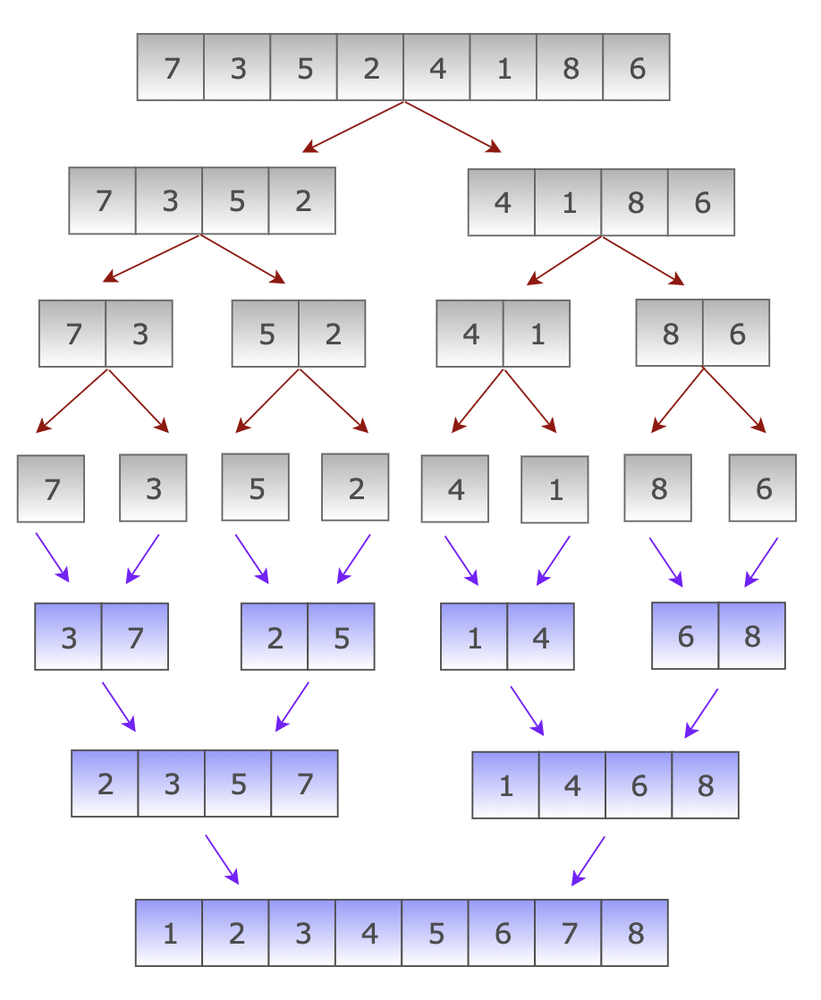
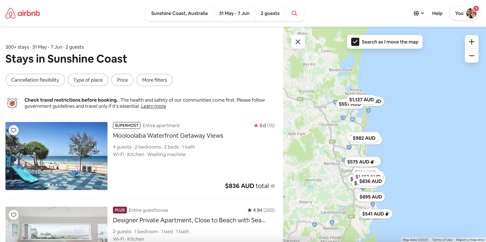

# Workbook - RfQ Response
#### T2A1 - Workbook | By Stephanie Duffieux | April 2020

The following has been prepared to respond to the technical section of the RfQ released by ACME Corporation who are seeking a vendor for the development of a marketplace web application using Rails for one of its product lines. 

### Q1. Describe the architecture of a typical Rails application

A typical Rails application is built using the MCV framework (MVC meaning Model, View and Controller) and the Ruby programming language. The relationship between the Model, View and Controller is known as the Request-Response Cycle which also uses a router to store pathways (URI's or Uniform Resource Identifier's) for each Controller action. To better understand the concept we need to describe the role of each:

* Role of the Router:

The Router stores routes (URIs) which link the web browser to the Controller's actions. When a user submits a request within the browser this will submit a route request to the routes.rb file within our Rails application which links a route to a specific action within the Controller. Another way to understand actions is that they are essentially methods stored within a Controller class. In Rails there are seven standard Controller actions that can be used to render and modify data: Index, New, Create, Show, Edit, Update, Delete. In HTTP language these actions are classed as GET, POST, PATCH/PUT, DELETE requests.  

* Role of the Controller:

The Controller acts as the middle man between the Model and the View. When prompted by a route request it passes the request to the Model which then retrieves the requested information from the Database and relays it back to the Controller. Once the information hits the Controller's action, the Controller then exchanges this information with the View which in return sends a HTML file to the Controller to render the information back to the web browser in human readable form.

* Role of the Model:

The Model acts as a link between the Database and the Controller, it is essentially the brains of the application which passes information from the Database to the Controller's class actions, also known as methods in Ruby. Models are Ruby classes which store and validate data in table forms. Data can be created, read, updated and deleted by the user through the Controller's class actions. This is also known as the Ruby on Rails CRUD functionalities.

* Role of the View:

The View renders human readable information to the Controller which then passes it to the web browser using HTML with embedded Ruby code. In Rails HTML files are formatted as html.erb(HTML with embedded Ruby) files and are styled using CSS or SASS. Using embedded Ruby within the HTML files enables a relationship between the View and the Controller actions. 

Rails' philosophy which prefers convention over configuration means it creates a more productive and effective environment for web development, therefore saving time and money in production. Rails MVC architecture and DRY principals (Don't Repeat Yourself) are also efficient for debugging and maintaining an application. Rails also provides many smart helper methods which allow developers to easily grant authorisation and access permissions to users, making it a powerful framework to develop secure applications. 

###### Visual Representation of the MVC Framework


[Image Source - Understanding Models, Views and Controllers - betterexplained.com](https://betterexplained.com/articles/intermediate-rails-understanding-models-views-and-controllers/)


### Q2. Identify a database management system (DBMS) commonly used in web applications (including Rails) and discuss the pros and cons of this database

A commonly used database management system in web applications, including Rails, is PostgreSQL. There are many advantages to using PostgreSQL, one is that it allows for full customisation of databases such as defining data types, index functions, table inheritances and choice of programming languages. Another advantage is its ability to run different parts of a program separately as it uses Multi-version Concurrency Control (MVCC). Concurrency in computer science defines the ability of a program to run tasks or algorithms separately without breaking other parts of the program. 

PostgreSQL was released in 1996 and has since established a positive and reliable reputation amongst developers, forming a large community of experienced users willing to support other developers through various forums therefore making it accessible to both new and experienced developers. It's documentation also allows for an easy setup and use.

Despite the many advantages of PostgreSQL there are still a few cons to using it as opposed to its rival MySQL which is still considered slightly more popular amongst developers. In comparison to MySQL, PostgreSQL runs at a lower speed mainly due to its scalability and data integration abilities. In most cases this wouldn't cause any issues however if you are not requiring all the extra features which are automatically integrated when using PostgreSQL then this issue could be considered as a disadvantage. 

Overall, the powerful and extensive components of PostgreSQL and its popularity amongst developers make it a database management system of choice, and its attributes should definitely be considered when selecting a database management system especially when building large applications with relational databases.    

### Q3. Discuss the implementation of Agile project management methodology	

Agile project management is based on the method of separating individual tasks of a project and allocating these tasks to different teams. Agile methodologies involve consultancy with the client at the start of each project and at completion of each stage, this allows for continuous improvement throughout each stage based on the client's feedback. The classic method of presenting a final product without consulting a client through the various stages of a project could result in a loss of production and budget due to the client potentially requiring major changes to the project. 

Agile project management values individuals, interactions, productive project management softwares, collaboration with customers and effective responses to change. Following the Agile methodology creates a long lasting relationship with clients as it allows to create and produce end products which entirely respond to the client's needs and expectations. 

When deciding on an Agile methodology one that is most popular amongst teams is the SCRUM method which involves a product owner, a scrum master and a scrum team. At the start of a project the product owner and the scrum master will consult to establish a list of product backlogs (a list of various items which will produce the end product). From then the scrum team, under supervision of the scrum master, will select a variety of product backlogs to complete over a certain period called a sprint, generally sprints will run for 2-4 weeks. During each sprint, the scrum team and the scrum master will assess the team's progress through daily scrum meetings, making sure to stay on task and within deadlines. At the end of each sprint the scrum master consults with the product owner to review the project and decide if any changes are needed. The team then closes the initial sprint and starts a new sprint, selecting a new backlog of products and completing any unfinished products from the initial sprint. The process continues as so with incremental sprints until the project is completed.

Agile project management has been largely adopted by web development compagnies as not only does it meet a client's demands, increases productivity and project completion timeframes but it also has proven to be a successful project management tool which produces better software.

###### Visual Representation of the Agile Scrum Process


[Image Source - What is Scrum? ics.ie](https://www.ics.ie/news/view/1653)

### Q4. Provide an overview and description of a standard source control workflow

Standard source control workflow allows to save changes to a file and different versions of a project over time. 

A popular source control workflow widely used by developers is known as Git. Git is used by the well known code sharing application Github. Github allows developers to store their code files from local to remote repositories which can be accessed on any computer by any user simply by forking or cloning a repository.

Source control enables us to revert back to previously saved versions of our files if we encounter issues with our current working file. It is also an efficient way for a team of developers to work and collaborate on the same project as it allows to track changes, determine who made those changes and therefore enabling teams to fix errors in a shorter amount of time. Using source control we can also create different versions of a project by storing these within different branches of our local and remote repositories. This also enables a team to present various versions of a project to a client and to push the final project to the master branch by creating pull requests. 

Source control is an effective way for each team members to work on their allocated tasks without interrupting the overall progress of a project. As team members progress through their tasks they are able to work on their files within their local repository (working file) and commit their changes to the remote repository (server) at any time. When changes or new features are ready to be merged to the master branch a pull request is made and changes must be reviewed and accepted into the remote master branch. 

##### Visual Representation of Githubs Source Control


[Image Source - Trailhead.salesforce.com](https://trailhead.salesforce.com/en/content/learn/projects/develop-app-with-salesforce-cli-and-source-control/add-salesforce-dx-project-to-source-control)

### Q5. Provide an overview and description of a standard software testing process 

Software testing plays a crucial role in the quality of any software or developed application. Deploying untested software to production could potentially cause major losses to a client's revenue or potentially create risks to its users. If we take the example of malfunctioning medical softwares these could potentially be life threatening to patients or on the other hand underperforming ecommerce websites could discourage clients from buying and therefore cause losses to a business owner. These are valid reasons why software testing cannot be overlooked and must be implemented during every stage of software development.

There are many forms of software testing processes which can be either automated or manual. Manual testing is a standard form of a software testing process. It involves several phases in which a tester performs various tasks as the end-user of a product and evaluates if a software is ready to run through to the production phase or if malfunctions need to be addressed. At the start of the manual testing process the tester will analyse the intended use of a software and how it should perform as per its requirements. The tester then implements a testing plan and creates a list of test cases which will be manually tested without any automation tools. Test cases are then executed and any defects are logged and sent back to the production team for fixing. The process of manual testing can be tedious as it is designed to cover almost all functions of a software, however the advantages of manual testing is that it is designed to ensure the end product will run as required and without error so as to provide quality working products to a client.

### Q6. Discuss and analyse requirements related to information system security and how they relate to the project

When developing any software or application, developers must analyse the three most common elements of information system security which are: confidentiality, integrity and availability. Information Sytems Security, also referred to as INFOSEC, is the process which ensures the integretity of information made available to users in any software or web application. It also determines user access to protect an application from potential threats such as theft of private information or installation of malicious software. Through information system security a developer will determine access controls to prevent any unauthorised use of an application and also protect sensitive data.

In order to determine how and exactly what needs to be secured within a marketplace application we need to perform intial risk assessments prior to the production phase. These risk assessments will define a list of items within the application which contain sensitive data and from there we are able to define a list of security mesures that will need to be implemented within the application. The following list of risk management procedures will need to be implemented prior to building a marketplace application:

* Access, Authentication and Authorisation Management
* Disaster Recovery and Data Backup Management
* Encryption Management
* Network Security Management

The main concern in the process of establishing risk assessments is to protect a company's or user's information from malicious attacks or theft and therefore determining what data is critical to both and how to protect that data.  

### Q7. Discuss common methods of protecting information and data and how you would apply them to the project

Common methods of protecting information and data in Marketplace applications involves securing all API credentials, cryptographic protection of all stored and transmitted data, encryption of user content, input validations, logging and error handling, Cross-Site Request Forgery (CSRF) defence, and protection of HTTP POST request using verification tokens.     

Using Ruby on Rails to build a Marketplace application brings in itself a highly secure framework and setting to work with. Rails offers many smart helper methods which can protect against SQL injection, account hijacking, bypass of access control, reading or modification of sensitive data or other security attacks. These helper methods are very useful as they avoid developers from making mistakes when setting up security systems within an application. We can also make use of popular Ruby Gems such as Devise or Rolify which assist in protecting an application through authentication and authorisation methods.

The following helper methods will assist in securing our Marketplace application:

1. Session Objects: 

* Session objects will track the number of active sessions a user is on, retain the existing session open while the user is still active, or will otherwise create a new session. It is also important to ensure our sessions don't store sensitive information within cookies as these can be manipulated by any user.
    
2. Verification Tokens: 

* Verification tokens protect against Cross-Site Request Forgery. These are stored within the applications Controller requests and are verified on the server by adding the "protect_from_forgery with: :exception" line within the Controller action. This is a new default method used in Rails 6. 
    
3. Legacy Actions: 

*   The legacy action redirects the user to the main action if they attempt to access sensitive information. To use this action we would add the following line within our legacy method "redirect_to(params.update(action'main'))".

4. Authentication and Authorisation Gems:

*   Commonly used gems are Devise, Rolify and Authlogic which allow developers to easily authorise user access, allocate user roles and protect user passwords by encryption.

5. Config Filter Parameters:

* Sensitive information or passwords are encrypted within our database, however hackers are able to access these if these are stored within our application's log. We can protect sensitive information or data by using the config.filter_parameters method within our log file (e.g "config.filter_parameters << :password").

More information on Rails security helpers or gems is available on the full Rails guide (available online - https://guides.rubyonrails.org/security.html). It is important stay up to date with the latest Rails documentation which advises of any new features or bug fixes.

### Q8. Research what your legal obligations are in relation to handling user data and how they can be met for the project

How customer and end-user's information or data is protected plays a major role in the success of an application. The legal obligation of a developer when handling user data is to provide the client with a secure application that does not leave a user's information susceptible to attack or compromise, this involves data encryption and general security of an application. Developers must also comply with a given country's laws if an application will be accessible by citizens of that country. In order to comply with these legal obligations the following best practices are recommended when building an application which will handle user data:

* Implement a privacy policy that will clearly explain how a client's or user's personal information will be used within the application, how it will be stored and who will have access to this data. 
* Obtain the client's consent to use the data or information as outlined in the privacy policy.  
* Minimise the quantity of user data collection.
* Make sure users are involved and understand why their personal data is collected by obtaining user consent prior to using certain features within the application. 
* Maintain a clean and updated database, making sure to remove any user's personal information when they delete their account or when business has been closed or sold.
* Follow all security protocols to limit liability in the event of a security breach. This involves rigorous testing of the application's security prior to sending it to production.  

### Q9. Describe the structural aspects of the relational database model. Your description should include information about the structure in which data is stored and how relations are represented in that structure.

Relational databases are a very effective way of creating databases by storing data points that relate to one another within model tables. These tables are organised into columns which each store one data type per row (e.g: string, boolean, integer) and rows which store data instances. Relational databases provide a flexible and structured way of storing and accessing data within an application. 

How data is structured: 

Relational database models typically contain a primary key (e.g the model's unique ID) and foreign keys which enable relationships between model tables. For instance we could create a model table called "Book" which would contain a primary key of "book ID". Within that table we could add a list of data instances of a book, e.g "title", "edition", "author", "genre". With relational database models we also have the ability to join different tables to each other if they share common attributes by using joining tables which contain the foreign keys of the tables it relates to. Taking the example of our "Book" model we notice it contains a foreign key of "author_id" and "genre_id", because a book belongs to an Author and has one or many Genres. However we could also think that an Author can have many books and many genres, therefore we could create a joining table Genre which would link Books and Authors through their foreign keys, this would create a relationship between the "Books" model and "Author" model tables through their Genres.

Overall aspect and structure of a relational database:

* Data is stored within tables containing data types (columns) and data instances (rows)
* Each table consists of a unique primary key (table ID) and can contain foreign key(s)
* Joining tables create relationships between tables (creating has_one, has_many or belongs_to relationships)

### Q10. Describe the integrity aspects of the relational database model. Your description should include information about the types of data integrity and how they can be enforced in a relational database.

The concept of data integrity is to ensure that all data stored within a relational database model is recorded exactly as intended. Data integrity is not to ensure the security of data through authorisations, instead its purpose is to avoid any unintended changes to data. Unintended changes could be of malicious intent, could result from unexpected crash or failure of hardware used to build an application or could occur because of a human error. In the case of data integrity aspects of the relational database model, rules are applied to define the relationship between models and what data they are able to access from other tables within the database schema. 

Data integrity in a relational database can be enforced by a series of rules or constraints which can be classed into three main types of data integrity; entity integrity, referential integrity and domain integrity.

###### Entity Integrity

Entity Integrity ensures that the identity of a table is unique. To do this a unique primary key ID is recorded against a models unique name. A primary key cannot be null and must be recored. In the instance of a User table the primary key would be recorded in the database as "user_id".

###### Referential Integrity

Referential Integrity protects the integrity of relationships between tables. A table can share a relationship with another table by storing its foreign key ID which relates to a certain primary key ID (from another table). With Referential Integrity a table can access data from another table it relates to. Dependency rules can also be applied to relational databases in the event data is deleted from certain tables, for example if a user deletes their account all their relating data would also be deleted (posts, comments, photos, etc...)

###### Domain Integrity

Domain Integrity implies that all columns in a relational database must belong to a domain. A domain refers to a set of values which are of the same type. Declaring a domain within a column avoids human errors and ensures data is recorded as intended. Taking the example of a User table which would store a user's full name, email and password, the domain for all three would be declared as "String", however if the table stored data such as a user's date of birth the domain in this instance could be declared as "Date".

### Q11. Describe the manipulative aspects of the relational database model. Your description should include information about the ways in which data is manipulated (added, removed, changed, and retrieved) in a relational database. 

A relational database model should be able to provide functionalities which enable it to manipulate data. Four basic functionalities a model must have are commonly known as CRUD, a model should be able to Create, Read, Update and Delete data. If an action cannot be performed by one of these functions then we should consider creating a model for that particular action. 

The CRUD framework is commonly used as a guide for developers to build full functioning models within an application. If we took the example of building a book store application the CRUD framework would function as follows:

###### CREATE

The Create function would be called when a new book is created and added to the book store. The application would record the data of the new book (e.g "Title", "Author", "Genre", "Price") and store it within the database with its own unique ID, which can be used to access the resource after it has been created.

###### READ

The Read function allows to retrieve the data of an existing book. This function does not change the data in anyway it simply displays existing resources. With Read, the application can display the full list of books available on the book store app or it can display any particular book at a time by calling its unique ID (which was assigned by the Create function).

###### UPDATE

The Update function enables data of a particular book to be updated and saved to the database. By calling a unique book ID we can amend the required values which would then be saved to the database. 

###### DELETE

The Delete function allows to remove a unique book ID from the database. Once the delete function is delcared on a unique book ID it will no longer exist in the database and won't appear in the list of books. 


### Q12. Identify and explain the workings of TWO sorting algorithms and discuss and compare their performance/efficiency (i.e. Big O)	

An algorithm as a whole can be defined as a set of steps which are taken to sort a problem. Sorting algorithms are used to manage data in Computer Programming by evaluating a list of data and sorting it in a specified order (e.g from smallest to largest). With sorting algorithms we can determine not only the steps it will take to solve a problem but also the complexity of solving it. In determining which sorting algorithm to use within a program we also need take into account not only its efficiency but the time it will take to run through a set of data to return a value. 

Commonly used sorting algorithms are Quick Sort, Bubble Sort, Merge Sort, Insertion Sort, Selection Sort, Heap Sort, Counting Sort or Bucket Sort, and can be categorised by their functions and limitations such as the number of times they take to run through a set of data, number of comparisons, recursive techniques, stability and space requirements (e.g memory space). To examine an algorithms efficiency we need to examine the worst case, average case and best case scenario of solving it. When we are talking Big O notation we typically look at the worst case scenario.

In order to understand the way sorting algorithms work we will discuss the workings of Bubble Sort and Merge Sort and compare their performance and efficiency:

#### Bubble Sort - Big O Complexity O(n2) 

Bubble Sort is considered one of the most basic sorting algorithms. It essentially compares an array of elements by running through each element and comparing it to its direct neighbour then swapping those two elements if the left element is greater than the one on the right. It will continue comparing through the array until it reaches the last element and no more swaps are needed. The overall functioning of Bubble Sort is that it uses comparisons to sort elements from smallest to largest. In some cases where we would only be able to access data by running through an array from start to finish and only having access to two values at a time Bubble Sort would be the most efficient sorting algorithm known to solve a problem or to manage data, however the downfall of using Bubble Sort in other cases would be the time it would take to run a Bubble Sort in comparison to other sorting algorithms. For example, comparing 100 integers using a Merge Sort would only require an average of 770 steps as opposed to approximately 5,000 steps to run a Bubble Sort on the same set of integers. The worst case run time complexity of a Bubble Sort is O(n2) meaning it executes a set of actions up to n times for an n sized data set placing it under a Merge Sort in the table of Big O complexity (longer sorting complexity than Merge Sort). O(n2) complexity is often found in nested loops.

To give an idea of how a bubble sort would work using Ruby as our programming language, the below code snippet, written by Maynard Cabalitan (https://coderwall.com/p/ssdcua/bubble-sort-in-ruby), defines a method "bubble_sort" which takes an unsorted "array" as an argument runs through the array comparing two elements at a time from left to right, swapping them in order of smallest to largest and then stopping when it reaches the last element of the array and all elements are sorted.  

``` 
    
  def bubble_sort(array_element)
      num = array_element.length
      swap = true
      while swap do
        swap = false
        (num - 1).times do |x|
          if array_element[x] > array_element[x + 1]
            array_element[x], array_element[x + 1] = array_element[x + 1], array_element[x]
        swap = true
          end
        end
      end 
      array_element
  end
  array_unsorted = [10,20,80,50,70,90,40,100,60,30]
  p bubble_sort(array_unsorted)

  prints => [10, 20, 30, 40, 50, 60, 70, 80, 90, 100]

```

#### Merge Sort - Big O Complexity O(n logo n)

Merge Sort is based on the divide and conquer pattern which was invented by John von Neumann in 1945. Essentially a merge sort would take an unsorted array of integers, divide it into two or more subarrays then sort each subarray individually before merging all subarrays into one sorted array. Merge Sort is considered to be one of the most efficient sorting algorithms and performs consistently with a run time complexity of O(n log n) even with very large data sets. 

How does a Merge Sort work? A Merge Sort can be visualised as a Tree, we would work our way from the top of the Tree by dividing an input array into subarrays, then again divide the subarrays until we reach the bottom of the tree where we would sort and merge the subarrays into one sorted array (top-down merge sort implementation). The following image shows a visual example of how a Merge Sort works from top to bottom, here we have an array input of numbers [7, 3 , 5, 2, 4, 1, 8, 6] which we initially divide into two subarrays, then these two arrays are divided again and then once more until we reach the middle of the tree where we have a list of individual arrays [7], [3], [5], [2], [4], [1], [8], [6], that we compare to each other, sort in order and continue to merge together until we reach a fully sorted array of all items [1, 2, 3, 4, 5, 6, 7, 8].


##### Picture from AlgoTree - https://algotree.org/algorithms/sorting/mergesort/

In conclusion, which one should we choose over the other? Analysing the time complexity of both sorting algorithms we can determine that Bubble Sort would quickly become inefficient with larger sets of data as it would take longer to solve a problem, whereas Merge Sort seems to be the best option when working with bigger sets of data and performs better in time complexity run time than Bubble Sort. 

### Q13. Identify and explain the workings of TWO search algorithms and discuss and compare their performance/efficiency (i.e. Big O)

As previously described, algorithms are a set of steps executed to solve a problem. In the case of search algorithms we are describing a set of steps that are executed to find a value in a group of things. There are several different types of search algorithms such as Jump Search, Interpolation Search, Exponential Search, Fibonacci Search, Sublist Search, and the two main search algorithms commonly used, Linear Search and Binary Search which we will describe and compare their performance and efficiency:

#### Linear Search - Big O Complexity O(n)

A Linear Search works by searching through elements of a list by searching one element at a time without skipping any elements. We can visualise a Linear Search as reading through a book in which we are searching for something in particular with no table of contents to guide us, we would have to read through the whole book until we find that specific item it is that we are looking for. In computer programming, a Linear Search would work by going through a set of array elements from the leftmost element of the array and compare each item of the array with the element we are searching for and continue as such until a match is found. Taking into consideration that a Linear Search doesn't skip any elements in a list when searching makes its worse run time complexity O(n) which quickly makes it an inefficient search algorithm if we had a large set of data to search through and therefore making its performance ineffective in comparison to a Binary Search which significantly cuts down its run time complexity which we will discuss further below.

#### Binary Search - Big O Complexity O(log n)

A Binary Search shares similarities with a Merge Sort, except a Binary Search will start searching from the middle of a sorted list and determine if the value that you are looking for is greater than or less than the value on the left half or right half. Once it has determined if the value is on the left or the right half, it will then search from the middle of that half and again proceeds to comparing if the element on the left or the right is greater than or less than the value that you are looking for. The process continues as such until it reaches a matched value. The only downfall to using a Binary Search in comparison to a Linear Search is that the set input data must be sorted whereas with a Linear Search this is not required as it compares every element of an array. However, due to the fact that a Binary Search uses the divide method and only searches through half elements of an array, and then continues to divide until it finds a match, brings its run time complexity to O(log n) which is significantly lower than a Linear Search, especially with larger sets of data. 

In conclusion, comparing both search algorithms and dependent on the type of input data that we are given to search through, a Binary Search could be more efficient in the event the data is already sorted and we are searching through a large set of data. However, given an unsorted, small to medium list a Linear Search would be the better option. 

##### Example of a Binary Search

```

  #taking an array of integers and comparing it to the target num
  #the code below runs through nested loops giving it a complexity run time of O(log n)

  def binary_search(array, num)
    half = array[array.length / 2]
    n = 0
    x = array.length - 1
  
    while n < x
      if half == num
        return num
      elsif half < num
        n = half
        half = n + x / 2
      else
        x = half
        half = n + x / 2
      end
    end
    false
  end

  p binary_search([1,2,3,4,5], 2)

  => prints 2

```

##### Example of a Linear Search

We could write the following pseudo code for a basic Linear Search

```
  # taking an array of integers from 0 to 10, if n is equal to 1 return "match found", 
  # else continue to compare with the next integer - Big O complexity O(n)

  for n = array[0..10]
    if n == 1 
      return "Match found"
      exit loop
    else next n[index +1]
    end
    
```

Or basic Ruby code

```

  def target(array, target)
    count = 0
    array.each do | element |
      count += 1
      if element == target
      return count
    end
  end

```

### Q14. Airbnb marketplace application research 


#### Airbnb History

Airbnb is a popular two sided marketplace application which was founded in 2008 by Nathan Blecharczyk, Brian Chesky and Joe Gebbia. It was one of the first applications to specialise in rental accommodation with a two sided market of property owners and short term renters. Airbnb started in the USA and quickly expanded worldwide and is now present in 191 countries making it one of the worlds most successful marketplace applications.



#### a. Software used by Airbnb:

###### Ruby on Rails - Ruby Framework
Ruby on Rails, often referred to as RoR, is a popular framework used by developers to build powerful and reliable web applications with a quick turnaround time. Rails uses Ruby as its programming language and is an open source platform. RoR uses the MVC structure (Model, View, Controller) and prefers convention over configuration. A great aspect of RoR is the many Gems available to use with the framework that significantly cut down on production time and overall make it a more secure framework to work with. 

###### React - Javascript Framework
React is a Javascript library used to create interactive user interfaces. Initially all views in Airbnb were built solely with Rails however with the growth and popularity of the application React was introduced to maximise speed and fluidity to enable a more efficient and user friendly experience. React mainly works on the view component of the MVC framework of an application. With React, changing data and reloading web pages doesn't affect the application's performance and therefore makes it a more scalable framework to work with when building larger applications.

###### Redux 
Redux is a Javascript open source library used for all API data like authentication.

###### Amazon S3 - Cloud Storage

Through its web server interface, Amazon S3 (Amazon Simple Storage) offers an object storage service which allows for a more efficient scalability, security and performance of an application.

###### Amazon RDS - Cloud Database
Amazon RDS(Relational Database Service) is used to store and operate a relational database in the cloud. 

###### Amazon EBS 
Amazon EBS (Elastic Book Store) is used by Amazon's Relational Database Service and provides a more efficient storage performance. 

###### MySQL - Database
MySQL is the most popular database management system mainly due to its high performance and scalability. It is commonly used for web databases to store any kind of data, varying from small records of data to a whole inventory of data used within e-commerce applications.

###### Redis - Key-Value Storage 
Redis is used to manipulate data stored within a database. It can be used to add values to hashes, append elements to a string, sorting values in the right order or retrieving values from a list. 

###### Presto, Druid, Airpal - Analytics
Presto, Druid and Airpal are open source tools that work together to analyse user data and application queries. 

###### Amazon ElastiCache
Amazon ElastiCache enables to speed the performance of an application through cache and in-memory storage of data and queries.

###### GraphQuery
GraphQuery is a powerful web developer tool used to query existing data with the applications APIs  

###### Hypernova - Javascript View Server
Hypernova is used in the new configuration of Airbnb to server-render React to enable a better user experience. Using Hypernova also allows the user to view the content faster and is an efficient way for search engines to index an application. 

#### b. Hardware used to host the Airbnb

###### Nginx - Web Server
Nginx is a high performing web server which revolutionised the way servers operate with large numbers of concurrent connections. It is known to be the highest performing web server and overtakes Apache and other popular servers due to its scalability and efficiency when working with dynamic web pages and modern web interfaces. Nginx supports all components of modern web environments such as HTTP/2, WebSockets and streaming of a wide variety of video formats.  

###### Amazon EC2 - Cloud Hosting
Amazon EC2 (part of Amazon Web Service) also known as Amazon Elastic Compute Cloud, works as a hosting provider which allows its users to run and operate their website and applications online by renting their virtual computers. Using Amazon EC2 allows developers to deploy their applications faster without the need to invest in server hardware and provides a secure web environment to manage application storage. It is also very efficient for growing applications with increased traffic loads as it automatically changes the system requirements to adapt to an application's growth, therefore removes the need to forecast traffic. 

#### c. Interaction of technologies within Airbnb

###### Backend and Frontend

Ruby on Rails was used to build the MVC framework and the backend of Airbnb, it uses Ruby as its programming language. The application's routes, controllers, models and schema are created using Rails and the view with React which was later introduced to speed up the application interface. React uses Javascript as its programming language and allows for powerful interactive user interfaces, it also works well with modern websites and browsers. Airbnb views are created in React with Javascript, HTML5, CSS and SASS. Airbnb's MVC framework interacts with the web browser which sends route requests to the applications controller actions which then interact with the models and the views to either return information to the user or to store data information in the database. 

###### Database Management

MySQL acts as a database management system for Airbnb which also works with Amazon RDS. Amazon RDS stores and operates the application's relational database in the cloud. Redis is also used in conjuction with MySQL and Amazon RDS to manipulate stored data.

###### Application Programming Interface

Airbnb utilises multiple API's (Application Programming Interface) which interact with the application. The main APIs used are: 

  * Twilio - a messaging API which sends push notifications to users via sms
  * Baintree - a payment API which allows users to pay for their bookings. Although PayPal is mainly used with Airbnb USA due to its popularity, Baintree is used for all other countries.
  * Facebook's Graph API - allows users to view any social connections they have with hosts or if Facebook friends have reviewed any listings.
  * Google Maps API - enables users to view where rental listings are located on the map 
  * Jumio Netverify - enables identity verification of users by providing card and ID scanning facilities within the application.

###### Cloud Based Services

Airbnb is a large cloud based application who's reliability and scalability heavily depend on Amazons Web Services and predominately uses the following Amazon Web Services which interact with the application:

  * Amazon RDS which stores data and simplifies the applications administration process
  * Amazon S3 and EBS act as storage for the applications data and images
  * Amazon EC2 provides hosting for the application
  * Amazon Cloud Front is a content delivery network which caches bulky content such as large images, videos and therefore improves the application speed when loading pages and downloading content.

###### Data Analytics and Tracking

Finally, data analytics are tracked within the application mainly using Airpal, Presto and Druid which work together to manage large amounts of data. Google Analytics and Google Conversion Tracking are also used to interact with the application to measure its popularity amongst users and to track visitor counts. 

#### d. How data is structured within Airbnb

Airbnb structures its data in a relational database schema. A relational database consists of tables that store data within the database or which are able to retrieve data from the database. A table is made of rows and columns which specify the data type to be stored. For example we would have a table "User" which would store a user's full name as a string, email as a string, password as a string, date of birth as date and any other relevant data for that table. A relational database can contain as many tables as necessary for the application but can also form joined tables which enables to create relationships between tables. In the instance of the User table we could also relate this table to the Booking, Listing and Review tables and taking into account that these tables also relate to each other in some way we would potentially have a Booking-Listing join table or Listing-Review join table. The relational database structure allows to retrieve data from tables that relate to each other and avoids having to write more lines of code than needed, this is referred to as the DRY principles.

#### e. Entities which must be tracked by Airbnb

Airbnb's entities are tracked using Rail's Active Records which enables to build application Models and associate relationships between them. Active Records allows for a smooth transition of data between Models and reduces the amount of code within an application (keeping our code DRY). 

The following entities are tracked in Airbnb:

###### Users (user first name, user last name, email, password,)

  * Users of Airbnb can sign up and create an account to become either a Host or a Guest
  * Users are given a role of either a Host or Guest 
  * Users identities are confirmed using Jumio Netverify which scans the user's ID

###### Roles (Guest, Host)

Because Airbnb is a two-sided marketplace its users can be assigned a role of either Guest or Host. A Guest can view listings available for rent, can make bookings and can leave reviews on listings. A Host can add rental listings to their account and can leave reviews on users that have rented their listings.

###### Rental Listings (listing type, price, calendar availability, location, pictures with Active Storage)

Each lisiting provides details on its amenities (e.g accommodation type - house, appartment, studio etc.., number of beds, shared appartment/house, whole appartment/house), price, availability, location, and pictures are available to view.

###### Listing Type (appartment, house, townhouse, studio, whole or partly rented)

Each Rental Listing has is also a Listing Type, because there are several listing types that can be available it can form its own database table. 

###### Bookings (date(calendar), check-in, check-out)

  * Hosts can make their listings available for bookings.
  * Guests can make a booking on a listing. 

###### Reviews (user review, listing review)

  * Guests are invited to leave a review on a listing after they have checked-out.
  * Hosts are invited to leave a review about a Guest after they have checked-out.

###### Location (Region, Suburbs)

Users can view where listings are located or search for listings by either their region or specific suburb.

  * Region (main city location of a listing)
  * Suburb (narrows down the location of a listing)

#### f. Relationships and associations between the entities identified in part (e)

The below relationships and associations are formed between the application's entities:

###### User Table

    User has zero or many Bookings (dependent destroy) => Guest User
    User has zero or many Reviews (dependent destroy) => Both Host and Guest User
    User has one or many listings (dependent destroy) => Host User
    User has one or many Roles => Guest, Host

###### Role Table

    After user registration a user is assigned a role => Guest or Host 
    Role belongs to User through User-Role

###### User-Role

    User-Role has one or many Roles
    User-Role has one or many Users

###### Booking-Listing Table

    Booking-Listing belongs to one or many Users through User-Roles
    Booking-Listing has one or many Rental Listings
    Booking-Lisitng has one or many Bookings
    Booking-Listing has one or many Reviews

###### Booking Table

    Booking belongs to User through Booking-Listing (dependent destroy)
    Booking belongs to Rental Listing through Booking-Listing (dependent destroy)

###### Rental Listing Table

    Rental Listing belongs to User with host role (dependent destroy)
    Rental Listing has one Listing Type
    Rental Listing has one or many Bookings through Booking-Listing
    Rental Listing has one or many Pictures through Active Storage

###### Listing Type

    Listing Type belongs to Rental Listing (dependent destroy)

###### Review Table

    Review belongs to User through Booking-Listing
    Review belongs to Rental Listing through Booking-Listing 


#### g. Interpreted Entity Relationship Diagram (ERD) appropriate for the database of Airbnb

The below Entity Relationship Diagram represents a visual representation of the potential schema design of Airbnb's database.


___

### References

* Matthew Main, Rails Request-Response Cycle - https://medium.com/@matthewmain/rails-request-response-cycle-819e9cd8fa4e 

* Tutorials Point, Ruby on Rails Framework - https://www.tutorialspoint.com/ruby-on-rails/rails-framework.htm

* Better Explained, Intermediate Rails: Understanding Models, Views and Controllers - https://betterexplained.com/articles/intermediate-rails-understanding-models-views-and-controllers/

* PostgreSQL Tutorial, What is PostgreSQL? - https://www.postgresqltutorial.com/what-is-postgresql/ 

* Technopedia, Concurrency - https://www.techopedia.com/definition/25146/concurrency-programming 

* PostgreSQL - https://www.postgresql.org/ 

* Wrike, Project Management Guide FAQ, What is Agile Methology in Project Management? - https://www.wrike.com/project-management-guide/faq/what-is-agile-methodology-in-project-management/

* Stackify, Examples of Agile Methodology - https://stackify.com/agile-methodology/ 

* ICS, What is Scrum? - An Overview - https://www.ics.ie/news/view/1653 

* Klint Finley, Tech Crunch, What Exactly is GitHub Anyway? - https://techcrunch.com/2012/07/14/what-exactly-is-github-anyway/

* Michael Ernst, Version control concepts and best practices -  https://homes.cs.washington.edu/~mernst/advice/version-control.html 

* Tools QA, Manual Testing -  https://www.toolsqa.com/software-testing/manual-testing/

* Altexsoft, Quality Assurance, Quality Control and Testing - The Basics of Software Quality Management - https://www.altexsoft.com/whitepapers/quality-assurance-quality-control-and-testing-the-basics-of-software-quality-management/

* John Sonmez, 7 Common Types of Software Testing - https://usersnap.com/blog/software-testing-basics/ 

* Technopedia, Information Systems Security - https://www.techopedia.com/definition/24840/information-systems-security-infosec 

* Computer Science Degree Hub, what is Information Systems Security? - https://www.computersciencedegreehub.com/faq/what-is-information-systems-security/

* Jake Olcott, September 2019, Cybersecurity Vs. Information Security: Is There A Difference? - https://www.bitsight.com/blog/cybersecurity-vs-information-security

* Information and Technology Services, Safe Computing, University of Michigan, Minimum Information Security Requirements for Systems, Application and Data - https://safecomputing.umich.edu/information-security-requirements 

* Rails Guides, Securing Rails Applications - https://guides.rubyonrails.org/security.html

* Wiktor Plaga, 70+ Ruby on Rails Security Best Practices & Vulnerabilities - https://hixonrails.com/ruby-on-rails-tutorials/ruby-on-rails-security-best-practices/

* Zoom App Marketplace, Security - https://marketplace.zoom.us/docs/guides/app-lifecycle-management/security

* Atlassian Marketplace Developer, Data privacy guidelines for developers - https://developer.atlassian.com/platform/marketplace/data-privacy-guidelines/ 

* TermsFeed, February 2020, A Designers/Developer's Role in a Client's Online Legal Agreeents - https://www.termsfeed.com/blog/designer-developer-clients-legal-agreements/

* Oracle Australia, What Is a Relational Database? - https://www.oracle.com/au/database/what-is-a-relational-database/

* Alex Allain, Sorting Algorithm Comparison - https://www.cprogramming.com/tutorial/computersciencetheory/sortcomp.html 

* FreeCodeCamp, Sorting Algorithms Explained - https://www.freecodecamp.org/news/sorting-algorithms-explained/ 

* Careerride.com, Data Structure - What is Bubble Sort and Quick Sort? - https://www.careerride.com/Data-structure-bubble-quick-sort.aspx 

* Jerry Coffin, How Efficient is Bubble Sort? - https://www.quora.com/How-efficient-is-bubble-sort 

* Victor S.Adamchik, CMU, 2009, Sorting - https://www.cs.cmu.edu/~adamchik/15-121/lectures/Sorting%20Algorithms/sorting.html

* AnnMargaret Tutu, Nov 2016, Sorting Algorithms: The Difference Between Bubble Sort and Merge Sort - https://medium.com/@codeAMT/sorting-algorithms-the-difference-between-bubble-sort-and-merge-sort-bc91c3c2aff1 

* Najam Syed, Aug 2018, Sorting Algorithms Visualized with Python Matplotlib (with code) - https://www.youtube.com/watch?time_continue=72&v=cgNFT4CadL4&feature=emb_title 

* InterviewBit, Merge Sort Algorithm - https://www.interviewbit.com/tutorial/merge-sort-algorithm/ 

* Karuna Sehgal, Dec 2017, An Simplified Explanation of Linear Search - https://medium.com/karuna-sehgal/an-simplified-explanation-of-linear-search-5056942ba965 

* BBC, Digital Design Principles - CCEA - https://www.bbc.co.uk/bitesize/guides/zts8v9q/revision/4 

* Andrew Southard, May 2017, Binary Search Implementation in Ruby - https://medium.com/@andrewsouthard1/binary-search-implementation-in-ruby-9636a4bf373c 

* Maynard Cabalitan, Coderwall, Bubble Sort in ruby - https://coderwall.com/p/ssdcua/bubble-sort-in-ruby

* GeeksforGeeks, Linear Search vs Binary Search - https://www.geeksforgeeks.org/linear-search-vs-binary-search/

* Builtwith - https://builtwith.com/detailed/airbnb.com.au

* Forbes, Feb 2019, What Technology Stack Does Airbnb Use? - https://www.forbes.com/sites/quora/2018/02/20/what-technology-stack-does-airbnb-use/#510d2aa74025

* Wordpress.com, History of Airbnb - https://airbnb370.wordpress.com/history-of-airbnb/ 

* Redant, Why Choose Ruby on Rails? - https://redant.com.au/software-development/ruby-on-rails-for-your-web-development?gclid=EAIaIQobChMI5dmtlLrY6QIVlMEWBR1kZQsQEAAYASAAEgKgYPD_BwE

* Stackshare, Airbnb - https://stackshare.io/airbnb/airbnb 

* 123 Reg Support Centre, What is MySQL and why do we need it? - https://www.123-reg.co.uk/support/servers/what-is-mysql-and-why-do-i-need-it/ 

* AWS, Amazon ElastiCache - https://aws.amazon.com/elasticache/ 

* Nginx, what is Nginx - https://www.nginx.com/resources/glossary/nginx/ 

* AWS, what is Amazon EC2 - https://docs.aws.amazon.com/AWSEC2/latest/UserGuide/concepts.html 

* C#Corner, What and Why React.js - https://www.c-sharpcorner.com/article/what-and-why-reactjs/ 

* Github, Hypernova - https://github.com/airbnb/hypernova 

* Yalantis, The Technology Stack Behind Airbnb - https://yalantis.com/blog/the_technology_stack_behind_airbnb/

* Wikipedia, Jumio, - https://en.wikipedia.org/wiki/Jumio

* Medium, Modelling ActiveRecord Associations with Airbnb - https://medium.com/@kaylouisebennett/modelling-activerecord-associations-with-airbnb-9e259398fc9b 

* SqIDBM, What is a Relational Database Schema - https://blog.sqldbm.com/purpose-of-relational-database-schema/ 

* Wikipedia, Data Integrity - https://en.wikipedia.org/wiki/Data_integrity 

* Code Academy, What is CRUD? - https://www.codecademy.com/articles/what-is-crud 

* Better Explained, Intermediate Rails: Understanding Models, Views and Controllers - https://betterexplained.com/articles/intermediate-rails-understanding-models-views-and-controllers/ 